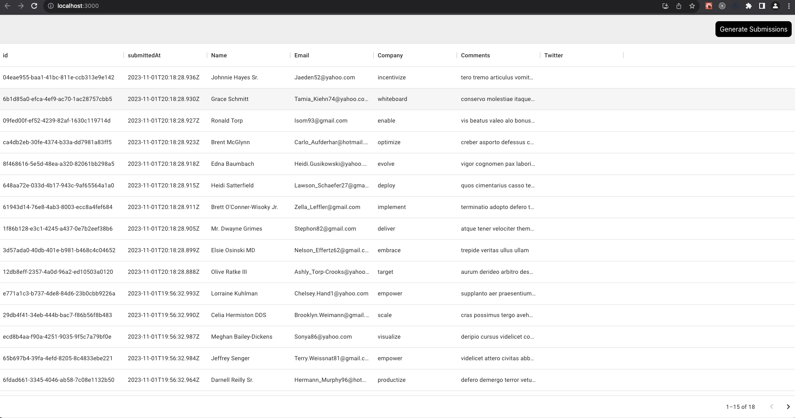

## formhub-fe (frontend)

This project was bootstrapped with [Create React App]

## About

Its a spa, ui containing mui datagrid (for simplicity).
It produces the data in tabular format which was submitted by users while filling "contact us" form(s). Each row represents
a submission by user.

To replicate the user's submissions, button `Generate Submissions` creates 10 (currently hardcoded this number) submissions.

## How

Clikcing the button triggers queue (bullmq) to trigger jobs containing fake data (implemented by faker lib)
to Redis which ultimately is saved in a
postgres db running in docker container.

## Scripts

In the project directory, run following to run ui:

### `yarn start`

Runs the app in the development mode.\
Open [http://localhost:3000](http://localhost:3000) to view it in the browser.

## How it looks in ui

